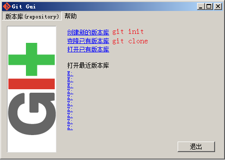
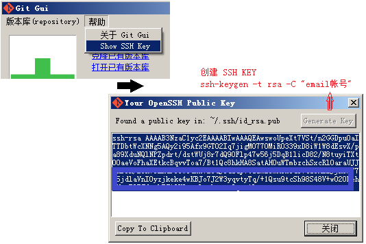
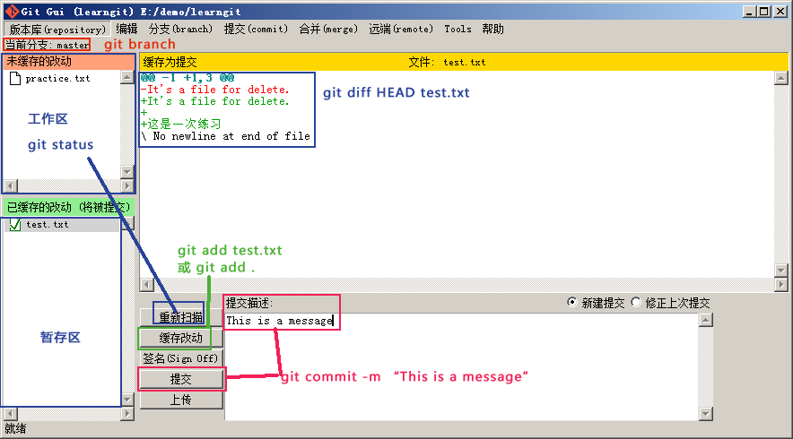
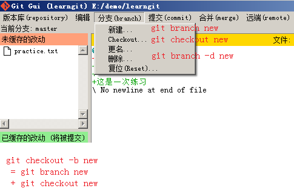
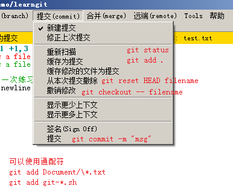
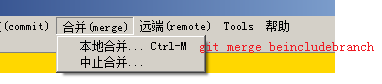
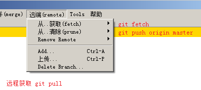
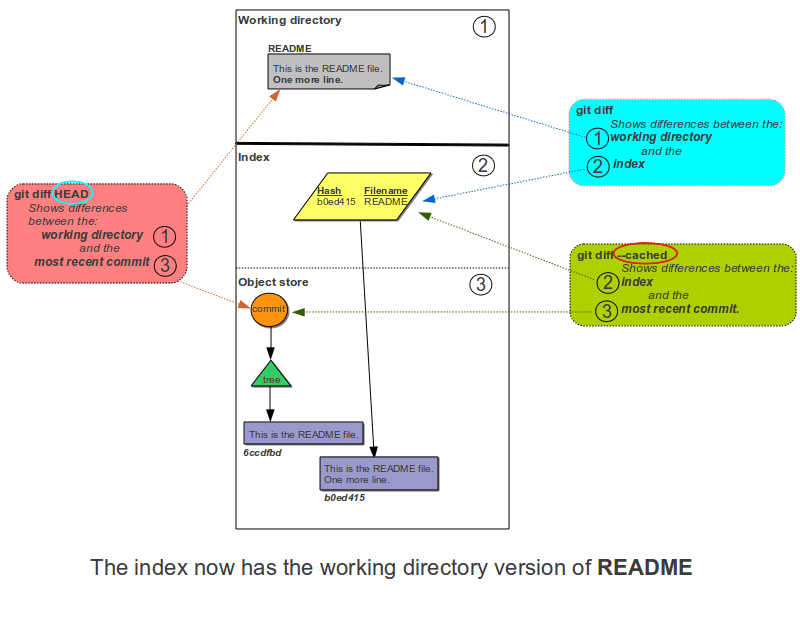

### Git 学习笔记

#### Git Gui 上那些常用的命令，因为通常是在command line 下操作的，这样就不用经常打开界面啦

#### 其它常用功能：

##### 查看文件修改记录

* 查看简单提交记录 git log --pretty=oneline fileName
* 查看详细提交记录 git log -p fileName
* 查看每一行提交	git blame fileName

##### git diff

[来源](http://www.gitguys.com/topics/git-diff/?lang=zh)