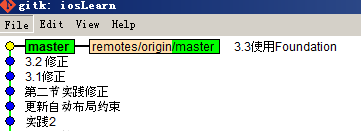
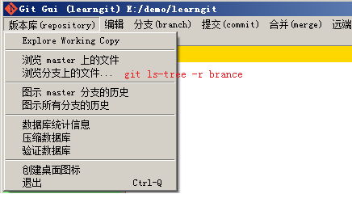

### Git 学习笔记

#### Git Gui 上那些常用的命令，因为通常是在command line 下操作的，这样就不用经常打开界面啦

##### merge的一个示例

命令：git merge remotes/origin/master

#### 其它常用功能：

##### 查看文件修改记录

* 查看简单提交记录  git log --pretty=oneline fileName
* 查看详细提交记录  git log -p fileName
* 查看每一行提交	 git blame fileName

##### git diff

1. 不同分支上的不同文件 
git  diff  branchA:fileA  branchB:fileB
2. 不同分支上的相同文件 
git  diff  branchA  branchB  --  file

##### 导出升级文件包
* git archive -o app.zip HEAD 打包整个项目
* git diff --name-only HEAD~2 显示最近2次提交修改的文件
* git archive -o update.zip HEAD $(git diff --name-only HEAD~2) 将最近2次修改的文件打包成 update.zip